# PENETRATION TESTING REPORT
## FOOTPRINTING, RECONNAISSANCE & NETWORK SCANNING PHASES

**W2-PM-FINAL | CYBERSECURITY | NETWORKWALKS**

### Pentester Information

| Field | Details |
|---|---|
| **Pentester Name** | **Narendra Singh Mahara** |
| **Program / Batch** | **B083 – Networkwalks** |
| **Program** | Cybersecurity & Ethical Hacking |
| **Week** | Week 02 |
| **Date** | **18 September 2026** |
| **Client / Target** | Networkwalks (`networkwalks.com`) and my own local LAN |
| **Permission** | Yes — authorized training target and own local network |
| **Phases Covered** | Phase 1: Reconnaissance & Footprinting<br>Phase 2: Scanning & Network Discovery |
| **Modules Completed** | W2-PM1, W2-PM2, W2-PM3, W2-PM4, W2-PM5 |
| **Status** | Week 2 Modules Completed |

---

# 1. Executive Summary

This report documents the practical cybersecurity activities I completed during **Week 2 of the Cybersecurity & Ethical Hacking Program at Networkwalks, Batch B083**.

The primary objective of these exercises was to understand how penetration testers and security professionals perform **information gathering, footprinting, reconnaissance, and network discovery** before proceeding to later stages of a penetration test.

During Week 2, I completed five practical modules:

1. **W2-PM1 – Footprinting & Reconnaissance Attacks with Multiple Kali Tools**
2. **W2-PM2 – Footprinting & Reconnaissance Attacks with GHDB**
3. **W2-PM3 – Footprinting with Maltego**
4. **W2-PM4 – Footprinting & Reconnaissance with theHarvester**
5. **W2-PM5 – Network Scanning with Zenmap**

The first four modules focused primarily on gathering information about the target through publicly available sources and reconnaissance techniques. The fifth module focused on discovering live hosts and understanding the structure of my own authorized local network.

The activities provided practical experience with several cybersecurity tools and techniques, including **WHOIS, WhatWeb, nslookup, curl, Wafw00f, DNSRecon, Google Hacking Database (GHDB), Maltego, theHarvester, Zenmap, Nmap, and Windows network commands**.

No exploitation or unauthorized access was performed as part of these modules. The activities were conducted for educational purposes against authorized targets and my own local network.

---

# 2. Liability Disclaimer

I performed these activities only against systems and networks where I had appropriate authorization or systems that I personally own.

The information and techniques documented in this report are intended for **educational, research, and authorized cybersecurity testing purposes only**.

Unauthorized scanning, enumeration, exploitation, or access to computer systems may violate applicable laws and regulations. The instructor, authors, and Networkwalks are not responsible for misuse of the information contained in this report.

All activities described in this report were performed within the authorized scope of my cybersecurity training.

---

# 3. Objectives

The main objectives of Week 2 were:

- Understand the purpose of reconnaissance in penetration testing.
- Learn how to collect publicly available information about a target.
- Identify domain registration and DNS information.
- Fingerprint web technologies.
- Understand HTTP response information.
- Identify WAF technologies.
- Learn how search engines can be used during authorized reconnaissance.
- Visualize relationships between domains, infrastructure, and digital identities using Maltego.
- Discover publicly available email and domain information using theHarvester.
- Identify live hosts within an authorized local network.
- Identify IP and MAC addresses where available.
- Understand basic network topology.
- Document reconnaissance findings professionally.

---

# 4. Scope

## 4.1 Authorized Web Target

**Target Domain:**

```text
networkwalks.com
```

The target was used as part of the authorized Networkwalks cybersecurity training program.

## 4.2 Authorized Local Network

The network scanning activity was performed against **my own local LAN**.

The actual IP range, live hosts, and MAC addresses are documented in the network scanning section and should be replaced with the exact values obtained during my practical exercise.

---

# 5. Tools Used

| Tool | Module | Purpose |
|---|---|---|
| Kali Linux | PM1–PM4 | Security testing and reconnaissance environment |
| WHOIS | PM1 | Domain registration and name-server information |
| WhatWeb | PM1 | Web technology fingerprinting |
| nslookup | PM1 | DNS resolution |
| curl | PM1 | HTTP response/header inspection |
| Wafw00f | PM1 | WAF detection |
| DNSRecon | PM1 | DNS enumeration |
| Google / GHDB | PM2 | Search-engine-based reconnaissance |
| Maltego | PM3 | Relationship and infrastructure mapping |
| theHarvester | PM4 | OSINT collection from public sources |
| Zenmap | PM5 | Network discovery and Nmap visualization |
| Nmap | PM5 | Host/network discovery |
| Windows CMD | PM5 | Local IP, subnet and MAC information |

---

# 6. Methodology

The Week 2 practical activities followed a reconnaissance-to-discovery workflow:

```text
Target
  │
  ▼
Passive Reconnaissance
  │
  ├── WHOIS
  ├── GHDB
  ├── Maltego
  └── theHarvester
  │
  ▼
Active / Technical Reconnaissance
  │
  ├── WhatWeb
  ├── nslookup
  ├── curl
  ├── Wafw00f
  └── DNSRecon
  │
  ▼
Network Discovery
  │
  └── Zenmap / Nmap
  │
  ▼
Documentation & Risk Analysis
```

This workflow helped me understand how information gathered during early reconnaissance can contribute to understanding a target's publicly visible infrastructure.

---

# 7. W2-PM1 — Footprinting & Reconnaissance with Multiple Kali Tools

## 7.1 Overview

In PM1, I used multiple Kali Linux tools to perform footprinting and reconnaissance against the authorized `networkwalks.com` domain.

The tools used were:

- WHOIS
- WhatWeb
- nslookup
- curl
- Wafw00f
- DNSRecon

Each tool provided a different type of information.

---

## 7.2 WHOIS Enumeration

WHOIS was used to obtain publicly available domain registration information.

### Command

```bash
whois networkwalks.com
```

### Information Observed

The WHOIS lookup provided information related to:

- Domain registration
- Registrar
- Domain status
- Name servers
- Registration-related dates

### Security Relevance

WHOIS information can help security professionals understand the publicly visible registration and DNS infrastructure associated with a domain.

It can also provide useful context during the initial reconnaissance phase.

### Evidence

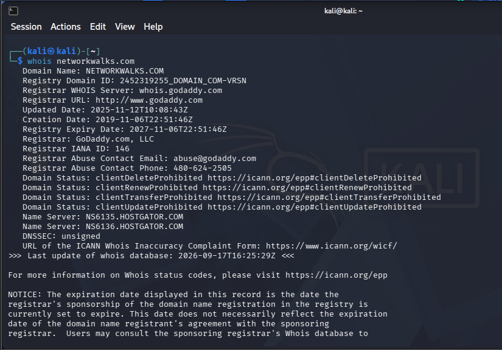

---

## 7.3 Web Technology Fingerprinting with WhatWeb

I used WhatWeb to identify technologies associated with the target website.

### Command

```bash
whatweb networkwalks.com
```

### Observation

The results identified technologies associated with the website, including:

- WordPress
- WordPress version information
- WP Download Manager
- Other web technologies

### Security Relevance

Technology fingerprinting can help identify the software stack used by a web application.

If an outdated version is discovered, a security professional can compare it with relevant security advisories during an authorized vulnerability assessment.

Technology identification alone does **not** confirm a vulnerability.

### Evidence

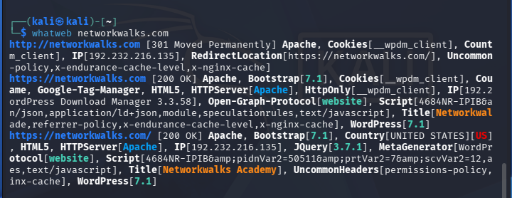

---

## 7.4 DNS Enumeration with nslookup

I used `nslookup` to resolve the target domain.

### Command

```bash
nslookup networkwalks.com
```

### Observation

The lookup returned:

```text
192.232.216.135
```

### Security Relevance

Identifying the IP address associated with a domain provides information about the network location of the web service.

### Evidence

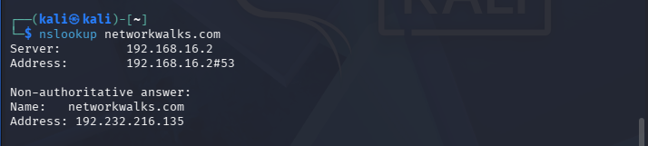

---

## 7.5 HTTP Header Inspection with curl

I used `curl` to inspect the HTTP response headers.

### Command

```bash
curl -I https://networkwalks.com
```

### Observation

The response provided technical information about the web service and indicated the availability of:

```text
/wp-json/
```

### Security Relevance

HTTP response headers can expose technical information that may assist technology fingerprinting.

Publicly accessible application endpoints may also provide information for further authorized enumeration.

The presence of `/wp-json/` itself does not constitute a vulnerability.

### Evidence

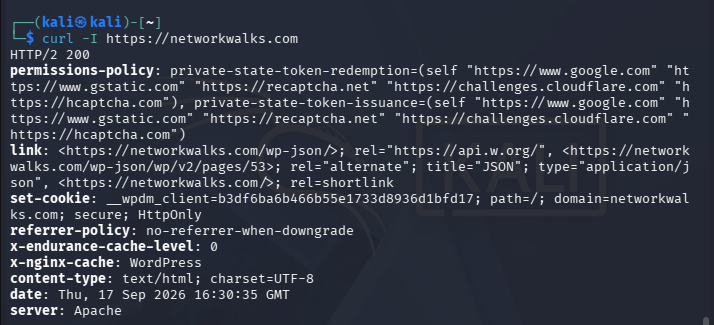

---

## 7.6 WAF Detection with Wafw00f

I used Wafw00f to determine whether a Web Application Firewall was protecting the website.

### Command

```bash
wafw00f https://networkwalks.com
```

### Observation

The tool identified:

```text
ModSecurity (SpiderLabs)
```

as the detected WAF technology.

### Security Relevance

Identifying a WAF helps a security professional understand the defensive architecture of a web application.

WAF detection alone does not establish whether an application is vulnerable or secure.

### Evidence

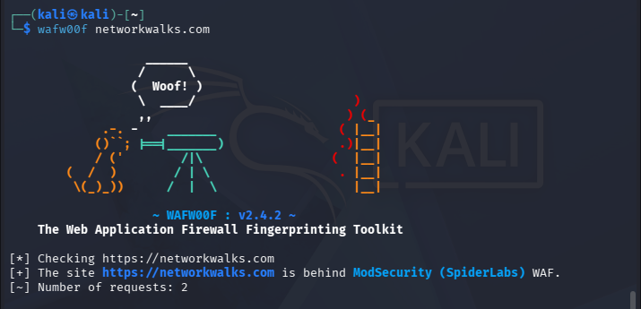

---

## 7.7 DNSRecon

I used DNSRecon to collect publicly available DNS information.

### Command

```bash
dnsrecon -d networkwalks.com
```

### Information Observed

The results provided information relating to:

- Name servers
- Mail servers
- DNS records
- TXT/SPF records
- Service records
- DNS infrastructure

### Security Relevance

DNS information can help security professionals build a broader understanding of an organization's publicly exposed infrastructure.

### Evidence

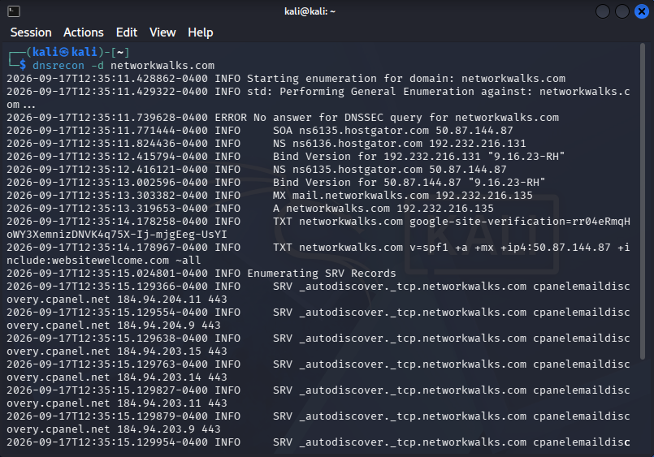

---

# 8. W2-PM2 — Footprinting & Reconnaissance with GHDB

## 8.1 Overview

In PM2, I learned about the **Google Hacking Database (GHDB)** and how search-engine queries can be used during authorized reconnaissance.

Search engines index publicly available information from websites. Specialized search operators can help security professionals locate specific categories of publicly accessible information.

The purpose of this exercise was to understand how search-engine reconnaissance can contribute to the information-gathering phase of a penetration test.

---

## 8.2 Tasks
### Vulnerable security camera
| No. | Link / Target             | Relevant Dork                            | Username / Password |
| --: | ------------------------- | ---------------------------------------- | ------------------- |
|   1 | `http://99.114.240.169:8080/` | `intitle:"webcamXP" inurl:8080`          | ---                 |
|   2 | `http://109.233.191.130:8080/` | `intitle:"Webcam" inurl:WebCam.htm`      | ---                 |
|   3 | `http://72.199.200.5:8080/` | `intitle:"webcamXP" inurl:8080`          | ---                 |
|   4 | `http://139.64.168.120:8080/` | `intitle:"webcamXP" inurl:8080`          | ---                 |
|   5 | `http://75.149.26.30:1024/multi.html` | `intitle:"webcamXP" inurl:8080`          | ---                 |
|   6 | `http://109.206.96.249:8080/ ` | `intitle:"webcamXP" inurl:8080`          | ---                 |
|   7 | `http://68.115.218.130:32479/home.html` | `inurl:/multi.html intitle:webcam`       | ---                 |
|   8 | ` http://83.41.12.44/ ` | `inurl:/multi.html intitle:webcam`       | ---                 |
|   9 | `http://184.57.102.6:5432/` | `intitle:"webcamxp" "Flash JPEG Stream"` | ---                 |
|  10 | `http://www.eisenbahn.dyndns.tv:8080/` | `intitle:"webcamxp" "Flash JPEG Stream"` | ---                 |

### Downloadable mathematics ebooks
| No. | Link                                                                                                                                                                                                                                                             | Relevant Dork                                           | Username / Password |
| --: | ---------------------------------------------------------------------------------------------------------------------------------------------------------------------------------------------------------------------------------------------------------------- | ------------------------------------------------------- | ------------------- |
|   1 | [https://www.skylineuniversity.ac.ae/pdf/math/](https://www.skylineuniversity.ac.ae/pdf/math/)                                                                                                                                                                   | `intitle:"index.of" "parent directory" mathematics pdf` | ---                 |
|   2 | [https://media.edusanjal.com/u/grade-10-mathematics.pdf](https://media.edusanjal.com/u/grade-10-mathematics.pdf)                                                                                                                                                 | `filetype:pdf "mathematics" "textbook"`                 | ---                 |
|   3 | [https://www.pngpie.org/wp-content/uploads/2024/08/Mathematics-Textbook-Grade-6.pdf](https://www.pngpie.org/wp-content/uploads/2024/08/Mathematics-Textbook-Grade-6.pdf)                                                                                         | `filetype:pdf "mathematics" "textbook"`                 | ---                 |
|   4 | [https://www.math.ksu.edu/~dbski/writings/further.pdf](https://www.math.ksu.edu/~dbski/writings/further.pdf)                                                                                                                                                     | `filetype:pdf mathematics`                              | ---                 |
|   5 | [https://chilot.wordpress.com/wp-content/uploads/2023/02/cbf89-grade-12-mathematics-textbook.pdf](https://chilot.wordpress.com/wp-content/uploads/2023/02/cbf89-grade-12-mathematics-textbook.pdf)                                                               | `filetype:pdf "mathematics" "textbook"`                 | ---                 |
|   6 | [https://upload.wikimedia.org/wikipedia/commons/6/63/Junior_High_School_Mathematics-_Book_I_%28IA_juniorhighschool00went%29.pdf](https://upload.wikimedia.org/wikipedia/commons/6/63/Junior_High_School_Mathematics-_Book_I_%28IA_juniorhighschool00went%29.pdf) | `filetype:pdf mathematics textbook`                     | ---                 |
|   7 | [https://ocw.mit.edu/courses/6-042j-mathematics-for-computer-science-spring-2015/mit6_042js15_textbook.pdf](https://ocw.mit.edu/courses/6-042j-mathematics-for-computer-science-spring-2015/mit6_042js15_textbook.pdf)                                           | `filetype:pdf "mathematics for computer science"`       | ---                 |
|   8 | [https://fetena.net/books_asset/books_26/collection/grade%209-mathematics_fetena_net_d3e7.pdf](https://fetena.net/books_asset/books_26/collection/grade%209-mathematics_fetena_net_d3e7.pdf)                                                                     | `filetype:pdf "grade 9" mathematics`                    | ---                 |
|  9 | [https://ncm.gu.se/wp-content/uploads/2020/06/10_34_043064_johansson.pdf](https://ncm.gu.se/wp-content/uploads/2020/06/10_34_043064_johansson.pdf)                                                                                                               | `filetype:pdf mathematics`                              | ---                 |
|  10 | [https://saintantoninus.org/documents/2014/6/Progress%20in%20Mathematics%20Grade%205%20textbook.pdf](https://saintantoninus.org/documents/2014/6/Progress%20in%20Mathematics%20Grade%205%20textbook.pdf)                                                         | `filetype:pdf "mathematics" "textbook"`                 | ---                 |
                                 

### Security Relevance

GHDB-based reconnaissance demonstrates how information that is already publicly indexed can sometimes reveal:

- Public documents
- Technology information
- Web pages
- Login-related pages
- Directory information
- Other publicly indexed resources

The discovery of an indexed resource does not mean that the resource is vulnerable.

---

## 8.3 Findings

During the practical exercise, I used authorized search queries to understand how search engines expose information about a target.

### Observation

The exercise demonstrated that search engines can provide information without directly interacting with the underlying application.

### Security Significance

Organizations should periodically review publicly indexed information and remove or restrict sensitive resources that should not be publicly accessible.

---

# 9. W2-PM3 — Footprinting with Maltego

## 9.1 Overview

In PM3, I used **Maltego** to understand how different pieces of publicly available information can be connected and visualized.

Maltego is useful for OSINT and reconnaissance because it represents information as entities and relationships.

---

### Task 1. Download & Install Maltego on a Windows Computer

#### Objective

Download and install **Maltego** on a Windows computer and prepare it for authorized footprinting and reconnaissance activities.

#### Procedure

1. Download and install **Maltego** on a Windows computer.
2. Launch Maltego after completing the installation.
3. Create or log in to a Maltego account if required.
4. Create a new Maltego graph.
5. Configure the required data sources and Transforms.
6. Verify that Maltego is ready to perform reconnaissance activities.

---

### Task 2. Find All Email Addresses Related to the Target Organization

#### Target

`networkwalks.com`

#### Authorization

The reconnaissance activity was performed on the target organization **with due permission** and was limited to publicly available information.

#### Objective

Use **Maltego** to identify publicly available email addresses associated with the target organization's domain:

`networkwalks.com`

#### Procedure

1. Open **Maltego**.

2. Create a new graph.

3. Add a **Domain** entity to the graph.

4. Enter the target domain:

   `networkwalks.com`

5. Run the relevant Maltego **Transforms** for domain and email reconnaissance.

6. Analyze the entities returned by the Transforms.

7. Identify email addresses associated with the target domain.

8. Record the discovered email addresses as reconnaissance findings.

9. Capture screenshots of the Maltego graph and discovered results.

#### Evidence — Target Domain

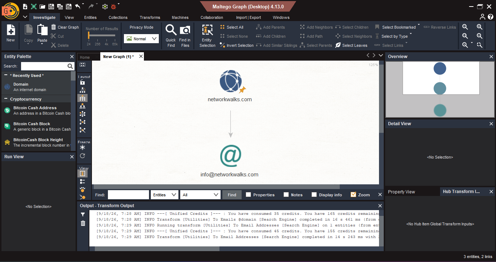


# 10. W2-PM4 — Footprinting & Reconnaissance with theHarvester

## 10.1 Overview

In PM4, I used **theHarvester** to collect publicly available information associated with an authorized domain.

theHarvester is an OSINT tool designed to gather information from public sources.

---

### Task 1. Find Email IDs & Sub-domains Related to the Target Organization Using Baidu

#### Objective

Find email IDs and sub-domains related to the target organization **`microsoft.com`** using the **theHarvester** tool in Kali Linux with **Baidu** as the data source.

The maximum number of results was set to **1000**.


#### Target

```text
microsoft.com
```

#### Procedure

1. Open **Kali Linux**.
2. Open the terminal.
3. Start theHarvester.
4. Specify the target domain as `microsoft.com`.
5. Select **Baidu** as the search source.
6. Set the result limit to **1000**.
7. Execute the scan.
8. Review the collected email IDs and sub-domains.
9. Record the results for the penetration-testing report.
10. Capture a screenshot of the terminal output as evidence.

#### Command

```bash
theHarvester -d microsoft.com -b baidu -l 1000
```

#### Evidence

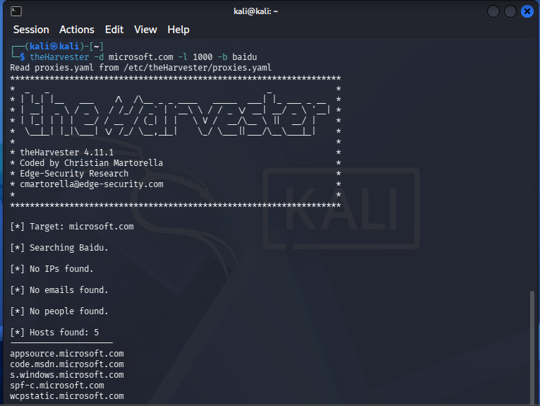


---

### Task 2. Find Email IDs & Sub-domains Using All Sources

#### Objective

Find email IDs and sub-domains related to **`microsoft.com`** using the **theHarvester** tool with all available supported data sources.

The maximum number of results was set to **50**.

#### Target

```text
microsoft.com
```

#### Procedure

1. Open **Kali Linux**.
2. Open the terminal.
3. Run theHarvester against the target domain.
4. Configure the result limit to **50**.
5. Use all available/supported sources.
6. Allow theHarvester to perform the reconnaissance.
7. Review the discovered email IDs and sub-domains.
8. Record the relevant findings.
9. Capture a screenshot of the results for evidence.

#### Command

```bash
theHarvester -d microsoft.com -l 50 -b all
```

#### Evidence

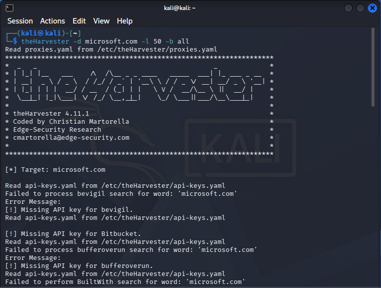


---


### Information Collected

TheHarvester was used to identify publicly available reconnaissance information including:

* Email IDs associated with the target domain
* Sub-domains
* Hostnames
* Other domain-related information returned by the selected sources


### Learning Outcome

Through this practical, I learned how to:

* Use **theHarvester** in Kali Linux.
* Perform passive reconnaissance against a domain.
* Search for publicly available email addresses.
* Enumerate sub-domains and hostnames.
* Use different information sources such as Baidu.
* Configure result limits for reconnaissance.
* Document OSINT findings as part of a penetration-testing assessment.


### Security Relevance

Publicly exposed email addresses and infrastructure information can contribute to an organization's attack surface.

Organizations should therefore review their public information footprint regularly.


---

# 11. W2-PM5 — Network Scanning with Zenmap

## 11.1 Overview

For PM5, I used **Zenmap**, the graphical interface for Nmap, to perform network discovery against my own local LAN.

The objective was to identify:

- Local IP address
- Subnet
- Live hosts
- IP addresses
- MAC addresses where available
- Network topology

The scan was performed only against my own authorized network.

---

## 11.2 Identifying Local IP Configuration

I used Windows CMD to identify my local network configuration.

### Command

```cmd
ipconfig /all
```

### My Network Information

| Information | Actual Value |
|---|---|
| IPv4 Address | **192.168.18.2** |
| Subnet Mask | **255.255.255.0** |
| Default Gateway | **192.168.18.1** |


---

## 11.3 Zenmap Ping Scan

After identifying my subnet, I entered the authorized network range into Zenmap.

### Scan Type

**Ping Scan**

The Ping Scan was used to identify hosts that were active on the network.

### Network Scanned

```text
10.0.0.0/24
```

### Live Hosts Discovered

| # | IP Address | Status |
|---|---|---|
| 1 | **10.0.0.1** | Up |
| 2 | **10.0.0.2** | Up |
| 3 | **10.0.0.10** | Up |
| 4 | **10.0.0.254** | Up |


### Evidence
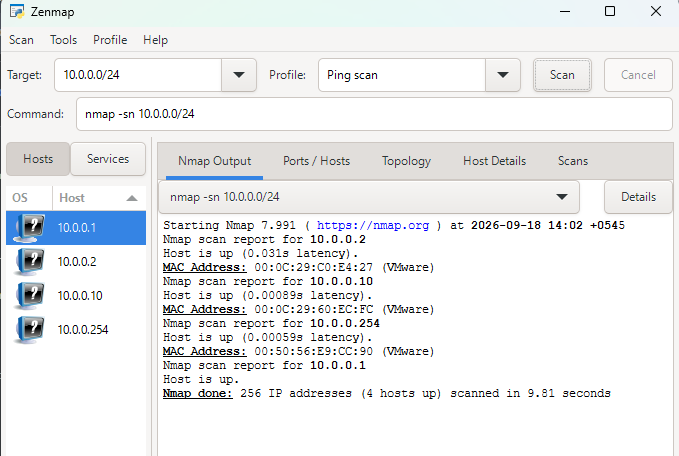

---

## 11.4 Zenmap Network Topology

After completing the network discovery scan, I opened the **Topology** section of Zenmap.

I enabled the topology legend and reviewed the graphical representation of the discovered hosts.

The topology provided a visual representation of the network environment and helped me understand how the discovered devices were related to the scanning host.

I also exported the topology as a PDF as required by the practical exercise.

### Evidence

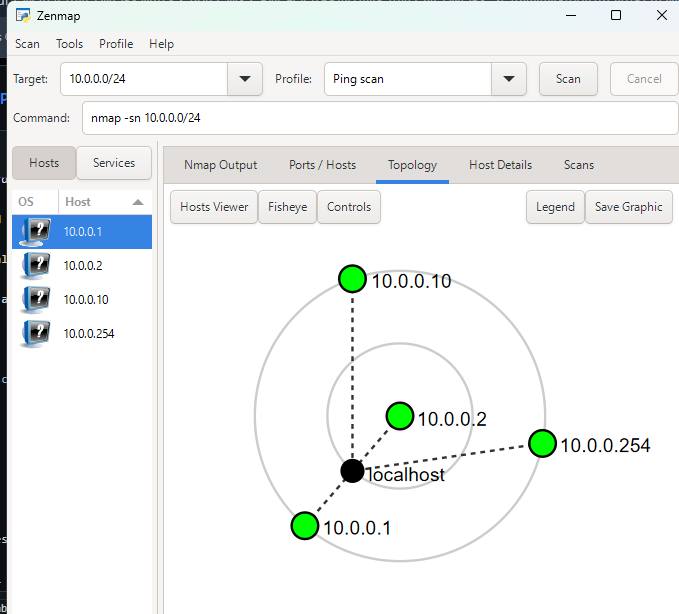


---

# 12. Consolidated Findings

The Week 2 practical exercises produced findings across multiple reconnaissance areas.

| # | Finding | Source / Tool | Security Significance |
|---|---|---|---|
| 1 | Domain registration information available | WHOIS | Provides publicly available domain information |
| 2 | Web technologies identifiable | WhatWeb | Helps identify the technology stack |
| 3 | Domain resolves to an IP address | nslookup | Identifies network location of the service |
| 4 | HTTP technical information available | curl | Can assist technology fingerprinting |
| 5 | WAF technology identified | Wafw00f | Provides information about defensive architecture |
| 6 | DNS records publicly available | DNSRecon | Helps map public infrastructure |
| 7 | Search-engine indexed information | GHDB | Demonstrates publicly discoverable information |
| 8 | Relationships between entities visualized | Maltego | Helps understand organizational footprint |
| 9 | Public OSINT information identified | theHarvester | Can reveal publicly available emails/hosts |
| 10 | Live hosts discovered | Zenmap | Provides visibility into the authorized local network |
| 11 | MAC addresses identified where available | Zenmap | Helps identify local network devices |
| 12 | Network topology generated | Zenmap | Provides a visual network overview |

---

# 13. Risk Analysis / Impact

The findings below are **potential security considerations rather than confirmed vulnerabilities**.

| # | Risk / Finding | Evidence | Potential Impact | Risk Level |
|---|---|---|---|---|
| 1 | Web technology information exposed | WhatWeb | May assist further technology fingerprinting | Medium |
| 2 | Server IP address identifiable | nslookup | Provides network location information | Low |
| 3 | HTTP technical information exposed | curl | May assist further enumeration | Low |
| 4 | WAF technology identifiable | Wafw00f | Reveals defensive architecture information | Low |
| 5 | DNS infrastructure information exposed | DNSRecon | Helps build an infrastructure profile | Medium |
| 6 | Public information indexed by search engines | GHDB | May expose information organizations did not intend to highlight | Medium |
| 7 | Public relationships identifiable | Maltego | Can help map an organization's digital footprint | Medium |
| 8 | Public email/host information discovered | theHarvester | May increase the publicly visible attack surface | Medium |
| 9 | Multiple live hosts visible | Zenmap | Unexpected devices may require investigation | Medium |

### Risk Level Key

- 🔴 **Critical**
- 🟠 **Medium**
- 🟢 **Low**

These ratings describe the potential security significance of the observations in the context of this educational exercise. They do **not** represent confirmed vulnerabilities.

---

# 14. Recommendations

## 14.1 Minimize Publicly Exposed Information

Organizations should periodically review their public digital footprint and minimize unnecessary technical information.

## 14.2 Keep Software Updated

Web servers, CMS platforms, plugins, and other software should be regularly updated and reviewed against current security advisories.

## 14.3 Review HTTP Headers

Organizations should review HTTP response headers and remove unnecessary technical information where appropriate.

## 14.4 Review DNS Records

DNS records should be reviewed periodically to ensure that only required services and records are publicly exposed.

## 14.5 Monitor Search Engine Exposure

Organizations should periodically review search engine results for their domains and identify documents or resources that should not be publicly indexed.

## 14.6 Review Public OSINT Exposure

Publicly available email addresses, hostnames, subdomains, and other information should be reviewed to ensure that sensitive information is not unnecessarily exposed.

## 14.7 Maintain an Asset Inventory

Organizations should maintain an accurate inventory of systems, devices, IP addresses, and services.

## 14.8 Perform Regular Internal Network Discovery

Authorized network scans should be performed periodically to identify unexpected or unauthorized devices.

## 14.9 Investigate Unknown Hosts

Any unexpected host discovered during an internal scan should be investigated and verified by the network administrator.

## 14.10 Maintain Network Documentation

Network topology and device information should be documented and updated regularly.

## 14.11 Maintain WAF Security Controls

The WAF should be properly configured, monitored, and regularly reviewed.

## 14.12 Perform Authorized Security Testing

Reconnaissance, scanning, vulnerability assessment, and penetration testing should always be conducted within a clearly defined and authorized scope.

---

# 15. Lessons Learned

During these practical exercises, I gained experience in several areas of cybersecurity.

### 15.1 Importance of Reconnaissance

I learned that reconnaissance is one of the most important early stages of a penetration test because it helps establish an understanding of the target environment before further security testing.

### 15.2 Multiple Tools Provide Different Perspectives

I learned that no single tool provides complete information.

For example:

- WHOIS provides registration information.
- WhatWeb identifies technologies.
- DNSRecon provides DNS information.
- Maltego visualizes relationships.
- theHarvester collects OSINT.
- Zenmap discovers hosts and network information.

Combining the results provides a broader understanding of the target.

### 15.3 Public Information Can Be Valuable

The GHDB and theHarvester exercises demonstrated that significant information can sometimes be obtained from publicly available sources without directly exploiting a target.

### 15.4 Visualization Improves Understanding

Maltego helped me understand how different entities can be connected, while Zenmap topology helped me visualize a local network.

### 15.5 Documentation Is Important

I learned that a professional cybersecurity assessment should clearly document:

- What was tested
- How it was tested
- What was discovered
- Evidence supporting the finding
- Potential security impact
- Recommended mitigation

### 15.6 Authorization Is Essential

The exercises reinforced the importance of performing reconnaissance and scanning only against systems and networks where appropriate authorization has been obtained.

---


# 16. Conclusion

During **Week 2 of my Cybersecurity & Ethical Hacking internship at Networkwalks, Batch B083**, I successfully completed all five practical modules covering **footprinting, reconnaissance, OSINT, and network scanning**.

In **PM1**, I worked with multiple Kali Linux tools and learned how different utilities can provide information about a target's domain, DNS infrastructure, web technologies, HTTP responses, and security controls.

In **PM2**, I learned how the **Google Hacking Database and search-engine operators** can be used as part of authorized reconnaissance to identify publicly indexed information.

In **PM3**, I used **Maltego** to visualize relationships between domains, infrastructure, and other publicly available entities. This helped me understand how individual pieces of information can be combined to create a broader picture of a target's digital footprint.

In **PM4**, I used **theHarvester** to collect publicly available OSINT relating to the authorized target. This demonstrated how publicly exposed email addresses, hostnames, and other information can contribute to reconnaissance.

In **PM5**, I used **Zenmap** to perform network discovery on my own local LAN. I identified my local network configuration, discovered active hosts, collected IP and MAC address information where available, and generated a network topology.

Overall, these five modules helped me understand the importance of information gathering before vulnerability assessment and exploitation. I learned that a penetration tester should first understand the target's publicly visible infrastructure and network environment before moving toward later phases of an assessment.

I also gained practical experience in collecting evidence and documenting technical findings in a structured manner.

Most importantly, the exercises reinforced that cybersecurity tools must be used responsibly and only against systems for which appropriate authorization has been obtained.

---

# End of Report

## 👤 Author

**Narendra Singh Mahara**  
Cybersecurity Student  
**Batch B083 – Networkwalks**

## 📌 Project Information

- **Program:** Cybersecurity Program at Networkwalks
- **Batch:** B083
- **Week:** 02
- **Modules:** W2-PM1, W2-PM2, W2-PM3, W2-PM4, W2-PM5
- **Focus:** Footprinting, Reconnaissance, OSINT & Network Scanning
- **Repository:** GitHub
